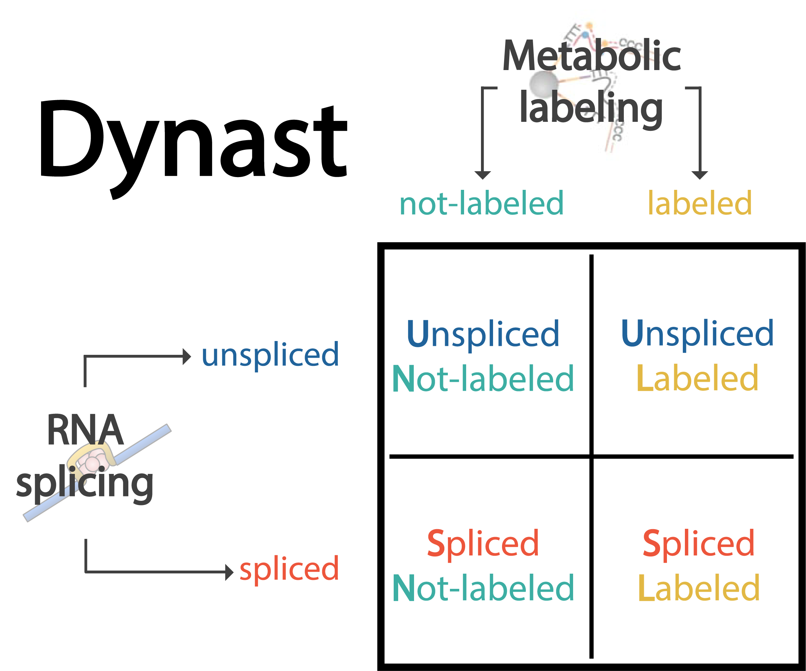

## Dynast: Inclusive and efficient quantification of labeling and splicing RNAs for time-resolved metabolic labeling based scRNA-seq experiments

[Getting started](https://dynast-release.readthedocs.io/en/latest/getting_started.html) - [Pipeline usage](https://dynast-release.readthedocs.io/en/latest/pipeline_usage.html) - [Technical information](https://dynast-release.readthedocs.io/en/latest/technical_information.html) - [Full documentation](https://dynast-release.readthedocs.io/en/latest/index.html)

Dynast is a command-line pipeline that preprocesses data from metabolic labeling scRNA-seq experiments and quantifies the following four mRNA species: unlabeled unspliced, unlabeled spliced, labeled unspliced and labeled spliced. In addition, dynast can perform statistical estimation of these species through expectation maximization (EM) and Bayesian inference.

### Key features
* Complete quantification of labeling and splicing of RNA.
    * Unlabeled unspliced, unlabeled spliced, labeled unspliced, labeled spliced species quantification.
    * Highly paralellized and optimized pipeline procedures.
* Statistical estimation procedure that corrects the observed unlabeled and labeled counts via a Bayesian inference framework.
