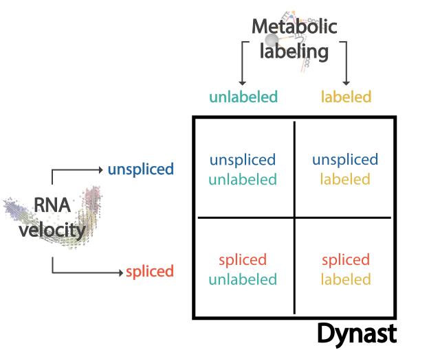
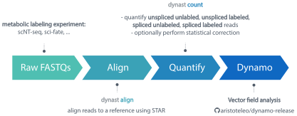

Getting started
===============
Welcome to dynast!

Dynast is a command-line pipeline that preprocesses data from metabolic labeling scRNA-seq experiments and quantifies the following four mRNA species: unlabeled unspliced, unlabeled spliced, labeled unspliced and labeled spliced. In addition, dynast can perform statistical estimation of these species through expectation maximization (EM) and Bayesian inference. Please see :ref:`statistical_estimation` for more details on how the statistical estimation is performed.

Installation
^^^^^^^^^^^^
The latest stable release of dynast is available on the Python Package Index (Pypi) and can be installed with pip::

	pip install dynast-release

To install directly from the Git repository::

	pip install git+https://github.com/aristoteleo/dynast-release

To install the latest *development* verson::

	pip install git+https://github.com/aristoteleo/dynast-release@devel

Please note that not all features may be stable when using the development version.

Command-line structure
^^^^^^^^^^^^^^^^^^^^^^
Dynast consists of four commands that represent four steps of the pipeline: :code:`ref`, :code:`align`, :code:`consensus`, :code:`count`, :code:`estimate`. This modularity allows users to add additional preprocessing between steps as they see fit. For instance, a user may wish to run a custom step to mark and remove duplicates after the :code:`align` step.

+------------------+-------------------------------------------------------------------+
| Command          | Description                                                       |
+==================+===================================================================+
| :code:`ref`      | Build a STAR index from a reference genome FASTA and GTF.         |
+------------------+-------------------------------------------------------------------+
| :code:`align`    | Align FASTQs into an alignment BAM.                               |
+------------------+-------------------------------------------------------------------+
| :code:`consensus`| Call consensus sequence for each sequenced mRNA molecule.         |
+------------------+-------------------------------------------------------------------+
| :code:`count`    | Quantify unlabeled and labeled RNA.                               |
+------------------+-------------------------------------------------------------------+
| :code:`estimate` | Estimate the fraction of labeled RNA via statistical estimation.  |
+------------------+-------------------------------------------------------------------+

Basic usage
^^^^^^^^^^^

Prerequisites:

* FASTQ files from a metabolic labeling scRNA-seq experiment
* **[Optional]** STAR genome index for the appropriate organism. Skip the first step if you already have this.

Build the STAR index
''''''''''''''''''''
First, we must build a STAR index for the genome of the organism that was used in the experiment. For the purpose of this section, we will be using the mouse (Mus musculus) as an example. Download the **genome (DNA) FASTA** and **gene annotations GTF**. If you already have an appropriate STAR index, you do not need to re-generate it and may skip to the next step.

.. code-block::

	dynast ref -i STAR Mus_musculus.GRCm38.dna.primary_assembly.fa.gz Mus_musculus.GRCm38.102.gtf.gz

where :code:`STAR` is the directory to which we will be saving the STAR index.

Align FASTQs
''''''''''''
Next, we align the FASTQs to the genome.

.. code-block::

	dynast align -i STAR -o align -x TECHNOLOGY CDNA_FASTQ BARCODE_UMI_FASTQ

where :code:`align` is the directory to which to save alignment files, and :code:`TECHNOLOGY` is a scRNA-seq technology. A list of supported technologies can be found by running :code:`dynast --list`. :code:`BARCODE_UMI_FASTQ` is the FASTQ containing the barcode and UMI sequences, whereas the :code:`CDNA_FASTQ` is the FASTQ containing the biological cDNA sequences.

[Optional] Consensus
''''''''''''''''''''
Optionally, we can call consensus sequences for each sequenced mRNA molecule.

.. code-block::

	dynast consensus -g Mus_musculus.GRCm38.102.gtf.gz --barcode-tag CB --umi-tag UB -o consensus align/Aligned.sortedByCoord.out.bam

where :code:`consensus` is the directory to which to save the consensus-called BAM. Once the above command finishes, the :code:`consensus` directory will contain a new BAM file that can be used as input to the following step.

Quantify
''''''''
Finally, we quantify the four RNA species of interest. Note that we re-use the gene annotations GTF.

.. code-block::

	dynast count -g Mus_musculus.GRCm38.102.gtf.gz --barcode-tag CB --umi-tag UB -o count --barcodes align/Solo.out/Gene/filtered/barcodes.tsv --conversion TC align/Aligned.sortedByCoord.out.bam

where :code:`count` is the directory to which to save RNA quantifications. We provide a filtered barcode list :code:`align/Solo.out/Gene/filtered/barcodes.tsv`, which was generated from the previous step, so that only these barcodes are processed during quantification. We specify the experimentally induced conversion with :code:`--conversion`. In this example, our experiment introduces T-to-C conversions.

Once the above command finishes, the :code:`count` directory will contain an :code:`adata.h5ad` AnnData file containing all quantification results.

[Optional] Estimate
'''''''''''''''''''
Optionally, we can estimate the unlabeled and labeled counts by statistically modelling the labeling dynamics (see :ref:`statistical_estimation`).

.. code-block::

	dynast estimate -o estimate count

where :code:`estimate` is the directory to which to save RNA quantifications. We provide the directory that contains the quantification results (i.e. :code:`-o` option of :code:`dynast count`).

Once the above command finishes, the :code:`estimate` directory will contain an :code:`adata.h5ad` AnnData file containing all quantification and estimation results.
