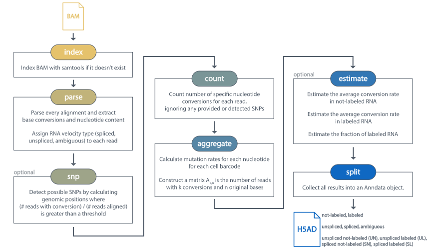
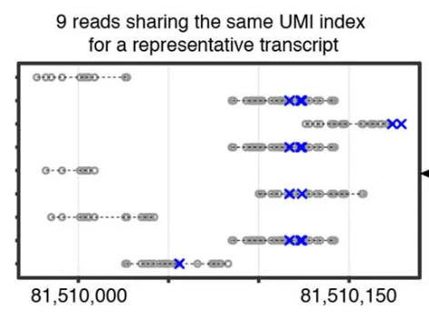

.. _technical_information:

Technical Information
=====================
This section details technical information of the quantification and statistical estimation procedures of the :code:`dynast consensus`, :code:`dynast count` and :code:`dynast estimate` commands. Descriptions of :code:`dynast ref` and :code:`dynast align` commands are in :ref:`pipeline_usage`.

.. _consensus_procedure:

Consensus procedure
^^^^^^^^^^^^^^^^^^^
:code:`dynast consensus` procedure generates consensus sequences for each mRNA molecule that was present in the sample. It relies on sequencing the same mRNA molecule (often distinguished using UMIs for UMI-based technologies, or start and end alignment positions for non-UMI technologies) multiple times, to obtain a more confident read sequence.

Why don't we just perform UMI-deduplication (by just selecting a single read among the reads that share the same UMI) and call it a day? Though it seems counterintuitive, reads sharing the same UMI may originate from different regions of the same mRNA, as [Qiu2020]_ (scNT-seq) observed in `Extended Data Fig.1b <https://www.nature.com/articles/s41592-020-0935-4/figures/7>`_.

Therefore, simply selecting one read and discarding the rest will cause a bias toward unlabeled reads because the selected read may happen to have no conversions, while all the other (discarded) reads do. Therefore, we found it necessary to implement a consensus-calling procedure, which works in the following steps. Here, we assume cell barcodes are available (:code:`--barcode-tag` is provided), but the same procedure can be performed in the absence of cell barcodes by assuming all reads were from a single cell. Additionally, we will use the term *read* and *alignment* interchangeably because only a single alignment (see the note below) from each read will be considered.

1. Alignments in the BAM are grouped into UMI groups. In the case of UMI-based technologies (:code:`--umi-tag` is provided), a UMI group is defined as the set of alignments that share the same cell barcode, UMI, and gene. For alignments with the :code:`--gene-tag` tag, assigning these into a UMI group is trivial. For alignments without this tag, it is assigned to the gene whose gene body fully contains the alignment. If multiple genes are applicable, the alignment is not assigned a UMI group and output to the resulting BAM as-is. For non-UMI-based technologies, the start and end positions of the alignment are used as a pseudo-UMI.
2. For each UMI group, the consensus base is taken for every genomic location that is covered by at least one alignment in the group. The consensus base is defined as the base with the highest sum of quality scores of that base among all alignments in the group. Loosely, this is proportional to the conditional probability of each base being a sequencing error. If the consensus base score does not exceed the score specified with :code:`--quality`, then the reference base is taken instead. Once this is done for every covered genomic location, the consensus alignment is output to the BAM, and the UMI group is discarded (i.e. not written to the BAM).

.. Note:: Only primary, not-duplicate, mapped BAM entries are considered (equivalent to the :code:`0x4`, :code:`0x100`, :code:`0x400` BAM flags being unset). For paired reads, only properly paired alignments (:code:`0x2` BAM flag being set) are considered. Additionally, if :code:`--barcode-tag` or :code:`--umi-tag` are provided, only BAM entries that have these tags are considered. Any alignments that do not satisfy all of these conditions are not written to the output BAM.

Consensus rules
'''''''''''''''

Here are the rules that are used to select a consensus nucleotide for a certain genomic positions, assuming :code:`--quality 27`.

1. Nucleotide with highest sum of base quality scores, given that the sum is greater than or equal to :code:`--quality`.

+---------------+------------+---------------+
| Source        | Nucleotide | Quality score |
+===============+============+===============+
| Reference     | A          | \-            |
+---------------+------------+---------------+
| Read 1        | C          | 10            |
+---------------+------------+---------------+
| Read 2        | C          | 20            |
+---------------+------------+---------------+
| Read 3        | A          | 20            |
+---------------+------------+---------------+
| **Consensus** | **C**      | **30**        |
+---------------+------------+---------------+

2. Reference nucleotide, if all of the sum of quality scores are less than :code:`--quality`.

+---------------+------------+---------------+
| Source        | Nucleotide | Quality score |
+===============+============+===============+
| Reference     | A          | \-            |
+---------------+------------+---------------+
| Read 1        | C          | 10            |
+---------------+------------+---------------+
| Read 2        | C          | 10            |
+---------------+------------+---------------+
| **Consensus** | **A**      | **20**        |
+---------------+------------+---------------+

3. When there is a tie in the highest sum of base quality scores and the reference nucleotide is one of them, the reference nucleotide.

+---------------+------------+---------------+
| Source        | Nucleotide | Quality score |
+===============+============+===============+
| Reference     | A          | \-            |
+---------------+------------+---------------+
| Read 1        | C          | 30            |
+---------------+------------+---------------+
| Read 2        | A          | 30            |
+---------------+------------+---------------+
| **Consensus** | **A**      | **30**        |
+---------------+------------+---------------+

4.  When there is a tie in the highest sum of base quality scores and the reference nucleotide is not one of them, the first nucleotide in lexicographic order (A, C, G, T).

+---------------+------------+---------------+
| Source        | Nucleotide | Quality score |
+===============+============+===============+
| Reference     | T          | \-            |
+---------------+------------+---------------+
| Read 1        | C          | 30            |
+---------------+------------+---------------+
| Read 2        | A          | 30            |
+---------------+------------+---------------+
| **Consensus** | **A**      | **30**        |
+---------------+------------+---------------+

Count procedure
^^^^^^^^^^^^^^^
:code:`dynast count` procedure consists of three steps:

1. :ref:`parse`
2. :ref:`snp`
3. :ref:`quant`

.. _parse:

:code:`parse`
'''''''''''''
1. All gene and transcript information are parsed from the gene annotation GTF (:code:`-g`) and saved as Python pickles :code:`genes.pkl.gz` and :code:`transcripts.pkl.gz`, respectively.
2. All aligned reads are parsed from the input BAM and output to :code:`conversions.csv` and :code:`alignments.csv`. The former contains a line for every conversion, and the latter contains a line for every alignment. Note that no conversion filtering (:code:`--quality`) is performed in this step. Two :code:`.idx` files are also output, corresponding to each of these CSVs, which are used downstream for fast parsing. Splicing types are also assigned in this step if :code:`--no-splicing` was not provided.

.. Note:: Only primary, not-duplicate, mapped BAM entries are considered (equivalent to the :code:`0x4`, :code:`0x100`, :code:`0x400` BAM flags being unset). For paired reads, only properly paired alignments (:code:`0x2` BAM flag being set) are considered. Additionally, if :code:`--barcode-tag` or :code:`--umi-tag` are provided, only BAM entries that have these tags are considered.

.. _snp:

:code:`snp`
'''''''''''
This step is skipped if :code:`--snp-threshold` is not specified.

1. Read coverage of the genome is computed by parsing all aligned reads from the input BAM and output to :code:`coverage.csv`.
2. SNPs are detected by calculating, for every genomic position, the fraction of reads with a conversion at that position over its coverage. If this fraction is greater than :code:`--snp-threshold`, then the genomic position and the specific conversion is written to the output file :code:`snps.csv`. Any conversion with PHRED quality less than or equal to :code:`--quality` is not counted as a conversion. Additionally, :code:`--snp-min-coverage` can be used to specify the minimum coverage any detected SNP must have. Any sites that have less than this coverage are ignored (and therefore not labeled as SNPs).

.. _quant:

:code:`quant`
'''''''''''''
1. For every read, the numbers of each conversion (A>C, A>G, A>T, C>A, etc.) and nucleotide content (how many of A, C, G, T there are in the region that the read aligned to) are counted. Any SNPs provided with :code:`--snp-csv` or detected from the :ref:`snp` step are not counted. If both are present, the union is used. Additionally, Any conversion with PHRED quality less than or equal to :code:`--quality` is not counted as a conversion.
2. For UMI-based technologies, reads are deduplicated by the following order of priority: 1) reads that have at least one conversion specified with :code:`--conversion`, 2) read that aligns to the transcriptome (i.e. exon-only), 3) read that has the highest alignment score, and 4) read with the most conversions specified with :code:`--conversion`. If multiple conversions are provided, the sum is used. Reads are considered duplicates if they share the same barcode, UMI, and gene assignment. For plate-based technologies, read deduplication should have been performed in the alignment step (in the case of STAR, with the :code:`--soloUMIdedup Exact`), but in the case of multimapping reads, it becomes a bit more tricky. If a read is multimapping such that some alignments map to the transcriptome while some do not, the transcriptome alignment is taken (there can not be multiple transcriptome alignments, as this is a constraint within STAR). If none align to the transcriptome and the alignments are assigned to multiple genes, the read is dropped, as it is impossible to assign the read with confidence. If none align to the transcriptome and the alignments are assigned multiple velocity types, the velocity type is manually set to :code:`ambiguous` and the first alignment is kept. If none of these cases are true, the first alignment is kept. The final deduplicated/de-multimapped counts are output to :code:`counts_{conversions}.csv`, where :code:`{conversions}` is an underscore-delimited list of all conversions provided with :code:`--conversion`.

.. Note:: All bases in this file are relative to the forward genomic strand. For example, a read mapped to a gene on the reverse genomic strand should be complemented to get the actual bases.

Output Anndata
''''''''''''''
All results are compiled into a single AnnData :code:`H5AD` file. The AnnData object contains the following:

* The *transcriptome* read counts in :code:`.X`. Here, *transcriptome* reads are the mRNA read counts that are usually output from conventional scRNA-seq quantification pipelines. In technical terms, these are reads that contain the BAM tag provided with the :code:`--gene-tag` (default is :code:`GX`).
* Unlabeled and labeled *transcriptome* read counts in :code:`.layers['X_n_{conversion}']` and :code:`.layers['X_l_{conversion}']`.

The following layers are also present if :code:`--no-splicing` or :code:`--transcriptome-only` was *NOT* specified.

* The *total* read counts in :code:`.layers['total']`.
* Unlabeled and labeled *total* read counts in :code:`.layers['unlabeled_{conversion}']` and :code:`.layers['labeled_{conversion}']`.
* Spliced, unspliced and ambiguous read counts in :code:`.layers['spliced']`, :code:`.layers['unspliced']` and :code:`.layers['ambiguous']`.
* Unspliced unlabeled, unspliced labeled, spliced unlabeled, spliced labeled read counts in :code:`.layers['un_{conversion}']`, :code:`.layers['ul_{conversion}']`, :code:`.layers['sn_{conversion}']` and :code:`.layers['sl_{conversion}']` respectively.

The following equalities always hold for the resulting Anndata.

* :code:`.layers['total'] == .layers['spliced'] + .layers['unspliced'] + .layers['ambiguous']`

The following additional equalities always hold for the resulting Anndata in the case of single labeling (:code:`--conversion` was specified once).

* :code:`.X == .layers['X_n_{conversion}'] + .layers['X_l_{conversion}']`
* :code:`.layers['spliced'] == .layers['sn_{conversion}'] + .layers['sl_{conversion}']`
* :code:`.layers['unspliced'] == .layers['un_{conversion}'] + .layers['ul_{conversion}']`

.. Tip:: To quantify splicing data from conventional scRNA-seq experiments (experiments without metabolic labeling), we recommend using the `kallisto | bustools <https://www.kallistobus.tools/>`_ pipeline.

Estimate procedure
^^^^^^^^^^^^^^^^^^
:code:`dynast estimate` procedure consists of two steps:

1. :ref:`aggregate`
2. :ref:`estimate`

.. _aggregate:

:code:`aggregate`
'''''''''''''''''
For each cell and gene and for each conversion provided with :code:`--conversion`, the conversion counts are aggregated into a CSV file such that each row contains the following columns: cell barcode, gene, conversion count, nucleotide content of the original base (i.e. if the conversion is T>C, this would be T), and the number of reads that have this particular barcode-gene-conversion-content combination. This procedure is done for all read groups that exist (see :ref:`read_groups`).

.. _estimate:

:code:`estimate`
''''''''''''''''
1. The background conversion rate :math:`p_e` is estimated, if :code:`--p-e` was not provided (see :ref:`background_estimation`). If :code:`--p-e` was provided, this value is used and estimation is skipped. :math:`p_e`s are written to :code:`p_e.csv`.
2. The induced conversion rate :math:`p_c` is estimated using an expectation maximization (EM) approach, for each conversion provided with :code:`--conversion` (see :ref:`induced_rate_estimation`). :math:`p_c`s are written to :code:`p_c_{conversion}.csv` where :code:`{conversion}` is an underscore-delimited list of each conversion (because multiple conversions can be introduced in a single timepoint). This step is skipped for control samples with :code:`--control`.
3. Finally, the counts are split into estimated number of labeled and unlabeled counts. These may be produced by either estimating the the fraction of labeled RNA per cell-gene :math:`\pi_g` directly by using :code:`--method pi_g` or using a detection rate estimation-based method by using :code:`--method alpha` (see :ref:`bayesian_inference`). By default, the latter is performed. The resulting estimated fractions are written to CSV files named :code:`pi_xxx.csv`, where the former contains estimations per cell-gene (:code:`--method pi_g`) or per cell (:code:`--method alpha`).

.. Note:: The induced conversion rate :math:`p_c` estimation always uses all reads present in the counts CSV (located within the count directory provided to the :code:`dynast estimate` command). Therefore, unless :code:`--no-splicing` or :code:`--transcriptome-only` was provided to :code:`dynast count`, `total` reads will be used.

Output Anndata
''''''''''''''
All results are compiled into a single AnnData :code:`H5AD` file. The AnnData object contains the following:

* The *transcriptome* read counts in :code:`.X`. Here, *transcriptome* reads are the mRNA read counts that are usually output from conventional scRNA-seq quantification pipelines. In technical terms, these are reads that contain the BAM tag provided with the :code:`--gene-tag` (default is :code:`GX`).
* Unlabeled and labeled *transcriptome* read counts in :code:`.layers['X_n_{conversion}']` and :code:`.layers['X_l_{conversion}']`. If :code:`--reads transcriptome` was specified, the estimated counts are in :code:`.layers['X_n_{conversion}_est']` and :code:`.layers['X_l_{conversion}_est']`. :code:`{conversion}` is an underscore-delimited list of each conversion provided with :code:`--conversion` when running :code:`dynast count`.
* If :code:`--method pi_g`, the estimated fraction of labeled RNA per cell-gene in :code:`.layers['{group}_{conversion}_pi_g']`.
* If :code:`--method alpha`, the per cell detection rate in :code:`.obs['{group}_{conversion}_alpha']`.

The following layers are also present if :code:`--no-splicing` or :code:`--transcriptome-only` was *NOT* specified when running :code:`dynast count`.

* The *total* read counts in :code:`.layers['total']`.
* Unlabeled and labeled *total* read counts in :code:`.layers['unlabeled_{conversion}']` and :code:`.layers['labeled_{conversion}']`. If :code:`--reads total` is specified, the estimated counts are in :code:`.layers['unlabeled_{conversion}_est']` and :code:`.layers['labeled_{conversion}_est']`.
* Spliced, unspliced and ambiguous read counts in :code:`.layers['spliced']`, :code:`.layers['unspliced']` and :code:`.layers['ambiguous']`.
* Unspliced unlabeled, unspliced labeled, spliced unlabeled, spliced labeled read counts in :code:`.layers['un_{conversion}']`, :code:`.layers['ul_{conversion}']`, :code:`.layers['sn_{conversion}']` and :code:`.layers['sl_{conversion}']` respectively. If :code:`--reads spliced` and/or :code:`--reads unspliced` was specified, layers with estimated counts are added. These layers are suffixed with :code:`_est`, analogous to *total* counts above.

In addition to the equalities listed in the :ref:`quant` section, the following inequalities always hold for the resulting Anndata.

* :code:`.X >= .layers['X_n_{conversion}_est'] + .layers['X_l_{conversion}_est']`
* :code:`.layers['spliced'] >= .layers['sn_{conversion}_est'] + .layers['sl_{conversion}_est']`
* :code:`.layers['unspliced'] >= .layers['un_{conversion}_est'] + .layers['ul_{conversion}_est']`

.. Tip:: To quantify splicing data from conventional scRNA-seq experiments (experiments without metabolic labeling), we recommend using the `kallisto | bustools <https://www.kallistobus.tools/>`_ pipeline.

Caveats
'''''''
The statistical estimation procedure described above comes with some caveats.

* The induced conversion rate (:math:`p_c`) can not be estimated for cells with too few reads (defined by the option :code:`--cell-threshold`).
* The fraction of labeled RNA (:math:`\pi_g`) can not be estimated for cell-gene combinations with too few reads (defined by the option :code:`--cell-gene-threshold`).

For statistical definitions of these variables, see :ref:`statistical_estimation`.

Therefore, for low coverage data, we expect many cell-gene combinations to not have any estimations in the Anndata layers prefixed with :code:`_est`, indicated with zeros. It is possible to construct a boolean mask that contains :code:`True` for cell-gene combinations that were successfully estimated and :code:`False` otherwise. Note that we are using *total* reads.

.. code-block:: python

  estimated_mask = ((adata.layers['labeled_{conversion}'] + adata.layers['unlabeled_{conversion}']) > 0) & \
      ((adata.layers['labeled_{conversion}_est'] + adata.layers['unlabeled_{conversion}_est']) > 0)

Similarly, it is possible to construct a boolean mask that contains :code:`True` for cell-gene combinations for which estimation failed (either due to having too few reads mapping at the cell level or the cell-gene level) and :code:`False` otherwise.

.. code-block:: python

  failed_mask = ((adata.layers['labeled_{conversion}'] + adata.layers['unlabeled_{conversion}']) > 0) & \
      ((adata.layers['labeled_{conversion}_est'] + adata.layers['unlabeled_{conversion}_est']) == 0)

The same can be done with other :ref:`read_groups`.

.. _read_groups:

Read groups
^^^^^^^^^^^
Dynast separates reads into read groups, and each of these groups are processed together.

* :code:`total`: All reads. Used only when :code:`--no-splicing` or :code:`--transcriptome-only` is not used.
* :code:`transcriptome`: Reads that map to the transcriptome. These are reads that have the :code:`GX` tag in the BAM (or whatever you provide for the :code:`--gene-tag` argument). This group also represents all reads when :code:`--no-splicing` or :code:`--transcriptome-only` is used.
* :code:`spliced`: Spliced reads
* :code:`unspliced`: Unspliced reads
* :code:`ambiguous`: Ambiguous reads

The latter three groups are mutually exclusive.

.. _statistical_estimation:

Statistical estimation
^^^^^^^^^^^^^^^^^^^^^^
Dynast can statistically estimate unlabeled and labeled RNA counts by modeling the distribution as a binomial mixture model [Jürges2018]_. Statistical estimation can be run with :code:`dynast estimate` (see :ref:`estimate`).

Overview
''''''''
First, we define the following model parameters. For the remainder of this section, let the conversion be T>C. Note that all parameters are calculated per barcode (i.e. cell) unless otherwise specified.

.. math::

  \begin{align*}
	  p_e &: \text{average conversion rate in unlabeled RNA}\\
		p_c &: \text{average conversion rate in labeled RNA}\\
		\pi_g &: \text{fraction of labeled RNA for gene } g\\
		y &: \text{number of observed T>C conversions (in a read)}\\
		n &: \text{number of T bases in the genomic region (a read maps to)}
	\end{align*}

Then, the probability of observing :math:`k` conversions given the above parameters is

.. math::

	\mathbb{P}(k;p_e,p_c,n,\pi) = (1-\pi_g) B(k;n,p_e) + \pi_g B(k;n,p_c)

where :math:`B(k,n,p)` is the binomial PMF. The goal is to calculate :math:`\pi_g`, which can be used the split the raw counts to get the estimated counts. We can extract :math:`k` and :math:`n` directly from the read alignments, while calculating :math:`p_e` and :math:`p_c` is more complicated (detailed below).

.. _background_estimation:

Background estimation (:math:`p_e`)
'''''''''''''''''''''''''''''''''''
If we have control samples (i.e. samples without the conversion-introducing treatment), we can calculate :math:`p_e` directly by simply calculating the mutation rate of T to C. This is exactly what dynast does for :code:`--control` samples. All cells are aggregated when calculating :math:`p_e` for control samples.

Otherwise, we need to use other mutation rates as a proxy for the real T>C background mutation rate. In this case, :math:`p_e` is calculated as the average conversion rate of all non-T bases to any other base. Mathematically,

.. math::

	p_e = average(r(A,C), r(A,G), \cdots, r(G,T))

where :math:`r(X,Y)` is the observed conversion rate from X to Y, and :math:`average` is the function that calculates the average of its arguments. Note that we do not use the conversion rates of conversions that start with a T. This is because T>C is our induced mutation, and this artificially deflates the T>A, T>G mutation rates (which can skew our :math:`p_e` estimation to be lower than it should). In the event that multiple conversions are of interest, and they span all four bases as the initial base, then :math:`p_e` estimation falls back to using all other conversions (regardless of start base).

.. _induced_rate_estimation:

Induced rate estimation (:math:`p_c`)
'''''''''''''''''''''''''''''''''''''
:math:`p_c` is estimated via an expectation maximization (EM) algorithm by constructing a sparse matrix :math:`A` where each element :math:`a_{k,n}` is the number of reads with :math:`k` T>C conversions and :math:`n` T bases in the genomic region that each read align to. Assuming :math:`p_e < p_c`, we treat :math:`a_{k,n}` as missing data if greater than or equal to 1% of the count is expected to originate from the :math:`p_e` component. Mathematically, :math:`a_{k,n}` is excluded if

.. math::

	e_{k,n}=B(k,n,p_e) \cdot \sum_{k' \geq k} a_{k',n} > 0.01 a_{k,n}

Let :math:`X=\{(k_1,n_1),\cdots\}` be the excluded data. The E step fills in the excluded data by their expected values given the current estimate :math:`p_c^{(t)}`,

.. math::

	a_{k,n}^{(t+1)} = \frac{\sum_{(k',n) \not\in X} B(k,n,p_c^{(t)}) \cdot a_{k',n}}{\sum_{(k',n) \not\in X} B(k',n,p_c^{(t)})}

The M step updates the estimate for :math:`p_c`

.. math::

	p_c^{(t+1)} = \frac{\sum_{k,n} ka_{k,n}^{(t+1)}}{\sum_{k,n} na_{k,n}^{(t+1)}}

.. _bayesian_inference:

Bayesian inference (:math:`\pi_g`)
''''''''''''''''''''''''''''''''''
The fraction of labeled RNA is estimated with Bayesian inference using the binomial mixture model described above. A Markov chain Monte Carlo (MCMC) approach is applied using the :math:`p_e`, :math:`p_c`, and the matrix :math:`A` found/estimated in previous steps. This estimation procedure is implemented with `pyStan <https://pystan.readthedocs.io/en/latest/>`_, which is a Python interface to the Bayesian inference package `Stan <https://mc-stan.org/>`_. The Stan model definition is `here <https://github.com/aristoteleo/dynast-release/blob/main/dynast/models/pi.stan>`_.

When :code:`--method pi_g`, this estimation yields the fraction of labeled RNA per cell-gene, :math:`\pi_g`, which can be used directly to split the total RNA. However, when :code:`--method alpha`, this estimation yields the fraction of labeled RNA per cell, :math:`\pi_c`. As was described in [Qiu2020]_, the detection rate per cell, :math:`\alpha_c`, is calculated as

.. math::

	\alpha_c = \frac{L_c}{\pi_c(L_c+U_c)}

where :math:`L_c` and :math:`U_c` are the numbers of labeled and unlableed RNA for cell :math:`c`. Then, using this detection rate, the corrected labeled RNA is calculated as

.. math::

	N'_c = \min \left( \frac{L_c}{\alpha_c}, L_c+U_c \right)
